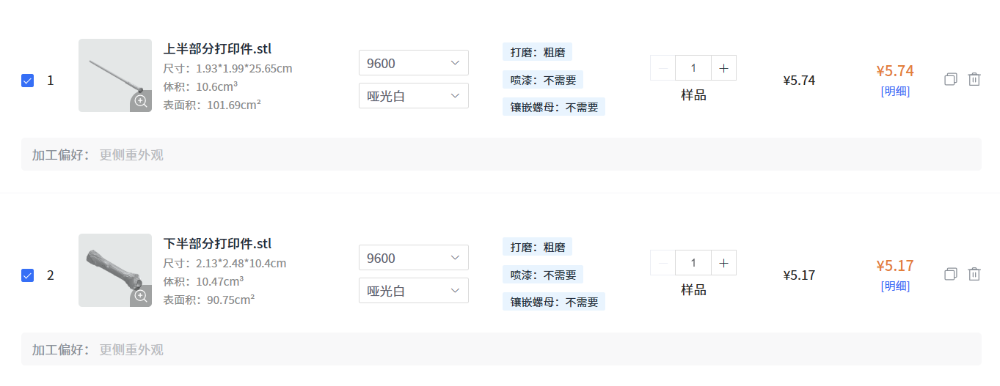

# Model

本目录存放魔杖的模型文件，包含Blender原工程和导出的STL文件，可直接使用STL文件进行3D打印。

## 下单注意事项

使用以下参数打印



另外由于**上半部分打印件**为细长中空盲孔模型，打印件可能会出现以下问题：

* 因模型45°摆放打印导致**打印件弯曲**

* 中空部分**残留树脂**，导致灯带无法塞入

为尽可能避免上述问题，请在下单前备注以下内容：

```
上半部分打印件需要竖直摆放进行打印，发货前请确保中空孔洞内干净无残留液体。
下半部分打印件无特殊要求。
```

## 模型说明

魔杖模型来源于[🪄 harry potter magic wand prop・Free OBJ File for ・Cults](https://cults3d.com/en/3d-model/game/harry-potter-magic-wand-prop)，经过微调、切割和挖空之后导出为STL文件，具体可查看Blender工程。
