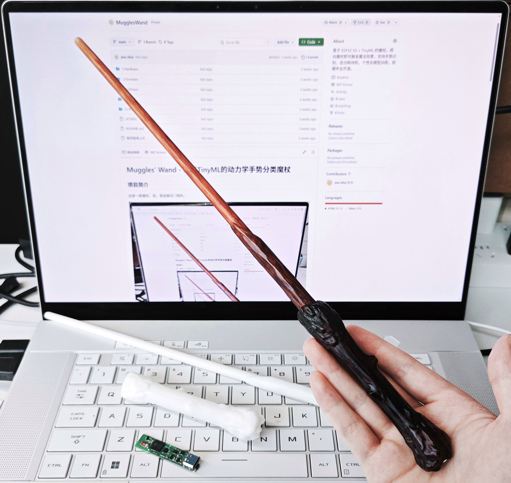
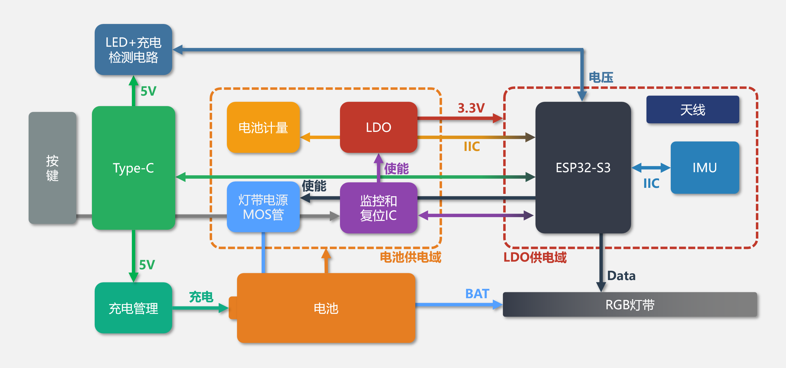
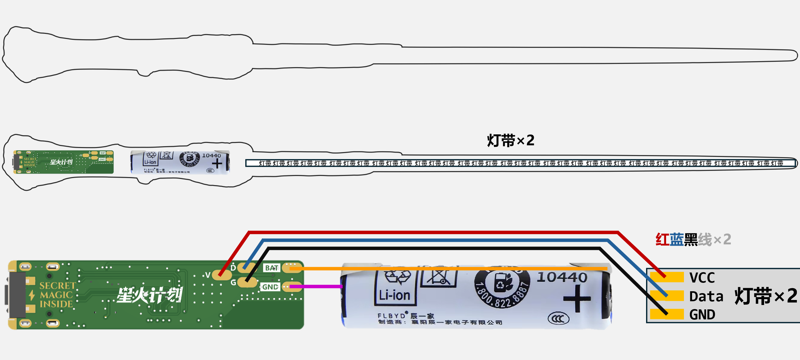
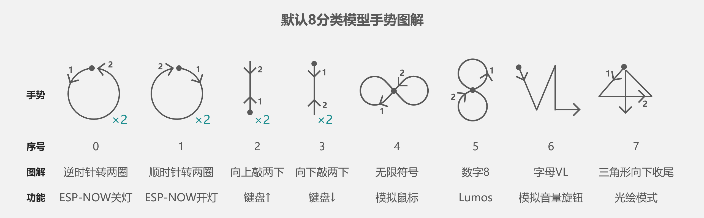
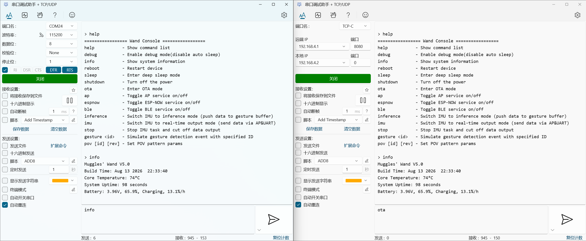
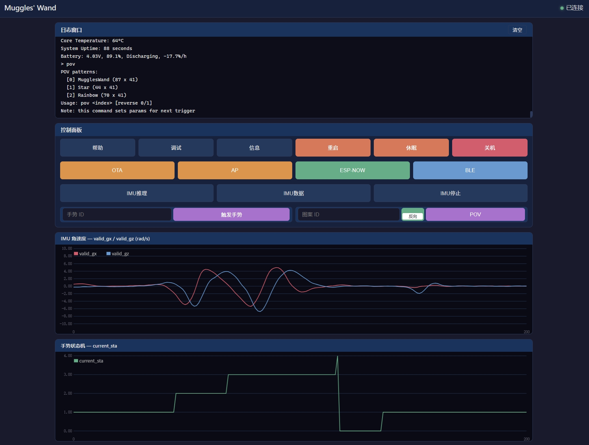

# Muggles' Wand - 基于TinyML的动力学手势分类魔杖

## 项目简介

这是一根魔杖，但，是给麻瓜[^1]用的。



在哈利波特初代魔杖模型中嵌入ESP32-S3、六轴 IMU 和神经网络模型，麻瓜无需魔法，只需标准地挥动魔杖，即可触发专属的“魔法效果”（如Lumos[^2]、模拟键鼠、光绘效果等）。

## 视频链接

[【开源】给麻瓜的魔杖]()

## 项目特点

- 哈利波特初代魔杖外形，内置RGB灯带提供施法光效。
- 基于ESP32-S3 + ICM42670P六轴 IMU，支持 Wi-Fi、BLE，便于扩展无线控制和交互功能。
- 精准电量 + 低功耗设计，静置待机，拿起开机，理论待机时间长达1.8年。
- 内置手势状态机自动区分有效手势和无意义挥动，无需提供显式手势开始(或结束)[^3]信号。
- 使用握持角度(姿势)无关变量训练模型，支持几乎任意握持姿角度/姿势。
- 配套上位机和魔杖Web端图形化界面，支持用户自行采集数据并训练个性化手势模型。

## 硬件架构

硬件由一块PCB + 电池 + 灯带组成。PCB集成了单片机、IMU、Type-C接口、按键以及跟电源相关的必要电路。



硬件位置关系及电气连接示意图如下。



## 使用方法

### 1. 基本操作

魔杖开机默认进入手势识别模式，固件内自带一个8分类的手势识别模型，识别如下手势：



只需要使用魔杖尖端在空中绘制出图形，就会触发对应的功能。挥动时间应≤1s，每个手势具体执行的功能可通过修改固件来自定义。

- ESP-NOW开关灯需要另一个接舵机的ESP32-S3开发板来执行动作，配套代码已开源在`2.Firmware`。
- 模拟键盘的按键可在固件中自定义。
- 光绘模式下，魔杖会持续检测加速度并自动触发光绘。

### 2. 按键操作

魔杖仅底部有一个按键，该按键承担了开机、关机、单击、双击、三击以及强制关机的功能。

- 关机时，单击按键开机。
- 开机时，长按按键1s关机；长按5s以上可强制断电关机[^4]。
- 开机时，单击按键的语义为“返回”，例如：模拟鼠标模式会占用IMU[^5]导致手势识别暂停，只需单击按键即可退出模拟鼠标模式。
- 双击、三击按键的行为可以在固件中自定义。

### 3. 使用命令操控魔杖

魔杖底部的 Type-C 接口连接 ESP32-S3 的USB虚拟串口(USB CDC)。将魔杖连接到 PC 后，通过串口助手与魔杖交互。可以像使用终端一样给魔杖发送命令，输入`help`获取可用命令，输入`ota`进入OTA模式。（下图左）

> 命令需要以回车符结尾才会被识别，另外需要打开串口助手的DTR和RTS才能通讯。

此外如果连接了魔杖的热点(AP)，还可以使用TCP/IP串口，地址192.168.4.1:8080（下图右）。



更进一步，连接魔杖热点情况下在浏览器中访问[192.168.4.1](http://192.168.4.1/)即可看到魔杖的Web端图形化界面，该界面功能和串口命令一致，但增加了IMU数据可视化。



## 功耗分析

超低的待机功耗是本项目亮点之一。

在**待机状态**下，ESP32处于DeepSleep模式，系统处于运动唤醒模式，此时功耗如下表所示：

| 器件  | ESP32 | 复位IC | 电池计量 | IMU   | LDO   | 合计值（理论） | 实际   |
| --- | ----- | ---- | ---- | ----- | ----- | ------- | ---- |
| 电流  | 7uA   | 6uA  | 4uA  | 3.5uA | 1.8uA | 22.3uA  | 25uA |

实测待机功耗约 25 μA，在电池400mAh的可用容量下的理论待机时间约1.8年[^6]。

`400mAh / 0.025mA = 16000h ≈ 1.8年`

所有状态功耗情况如下表所示。

| 状态      | 功耗     | 备注                           |
| ------- | ------ | ---------------------------- |
| 关机      | 3uA    | LDO输出关断，系统仅复位IC和电池计量IC耗电     |
| 待机      | 25uA   | LDO输出使能，系统处于DeepSleep+运动唤醒状态 |
| 开机，关闭射频 | <100mA | -                            |
| 开机，开启射频 | <200mA | 实测续航约为2h                     |

由于灯带耗电量较高，故在光绘模式下续航可能无法达到2h。

## 上位机与模型训练

默认模型的训练数据有限，不同用户的挥动习惯可能导致识别准确率下降，也就是魔杖出现了“认主”现象。`3.Software`下提供数据采集工具和 TensorFlow 模型训练代码，用户可以自行采集数据并训练个性化模型，给魔杖“易主”。

另外，还提供将任意图片转换为光绘数组的上位机工具`POVTool`，自定义专属光绘图案。

## 复刻

由于固件源码以 Git 子模块方式管理，克隆项目时需要加上 `--recurse-submodules` 参数：

```bash
git clone --recurse-submodules https://github.com/zou-shui/MugglesWand.git
```

复刻可参考根目录下的[复刻指南.PDF](./复刻指南.pdf)，步骤包括硬件复刻、固件烧录、封装、上色和喷漆。

项目结构：

```
MugglesWand
 ├── 1.Hardware/      PCB工程、原理图、制版文件
 ├── 2.Firmware/      ESP32-S3固件及源码
 │   ├── MugglesWand-src/         魔杖源码（子仓库）
 │   ├── MugglesWand-firmware/    魔杖固件
 │   └── EspNow_Slave-src/        ESP-NOW舵机开关灯执行器源码
 ├── 3.Software/      数据采集、训练及上位机工具
 ├── 4.Model/         魔杖外壳模型
 ├── 5.Others/        数据手册、图片
 ├── 复刻指南.pdf
 └── README.md
```


[^1]: 麻瓜，英文Muggle，指不会魔法的普通人

[^2]: Lumos，魔杖照明咒，是一个可以点亮魔杖头、用来在黑暗中照明的魔咒

[^3]: 传统基于 IMU 的手势识别通常需要额外输入信号标记手势开始或结束。本项目通过手势状态机自动检测有效手势，从而无需额外的开始/结束按键。

[^4]: 强制关机是硬件级的，会直接关断LDO输出

[^5]: 不止模拟鼠标模式会占用IMU，模拟音量旋钮以及光绘模式都会占用IMU

[^6]: 魔杖所使用电池的额定容量为450mAh，但监控复位IC(STM6601)会在电池3.1V以下时关断LDO并无法再次开机，所以估计电池可用容量为400mAh。另外由于电池自放电等因素影响，实际待机时间可能会更短。
